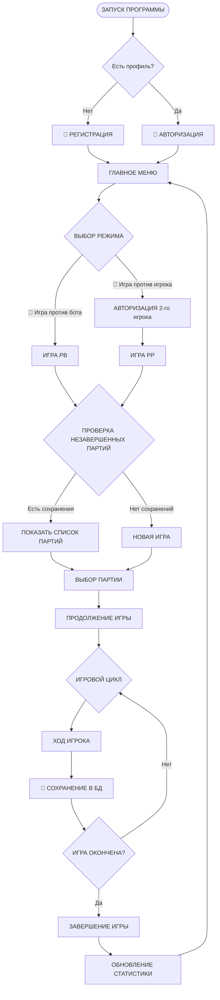

# Аналитика на персистентное хранение игр

---

## План работы по аналитике

### 1. Цель работы
### 2. Изучение и сравнение возможных вариантов решения(Выбор СУБД)
### 3. Подключение СУБД к исходному коду
### 4. Рефакторинг исходного кода с изменением UI и внедрением СУБД
### 5. Тестирование
### 6. Релиз

---

# Техническое задание: Система управления партиями в "Морской бой" и статистикой игроков

## 1. Цель проекта
Разработка системы для сохранения и управления партиями в игре "Морской бой" между игроками с возможностью продолжения игр после перезапуска приложения и ведением персональной статистики.

## 2. Основные требования

### 2.1. Управление игроками
- Возможность создания и управления профилями игроков (например: "Петя", "Вася")
- Каждый игрок должен иметь уникальный идентификатор в системе
- Хранение базовой информации об игроке (имя)

### 2.2. Управление партиями в "Морской бой"
- Сохранение полного состояния партий между запусками приложения:
    - Расстановка кораблей обоих игроков
    - История выстрелов
    - Текущий ход
    - Состояние игровых полей (10×10)
- Возможность возврата к незавершенным партиям
- Привязка партии к двум конкретным игрокам на весь срок её существования
- **Важное ограничение**: В середине партии смена игроков невозможна. При перезапуске приложения партию могут продолжить только те же два игрока, которые её начали.

### 2.3. Статистика и аналитика
- Для каждого игрока должна вестись статистика:
    - Количество выигранных партий (побед)
    - Количество проигранных партий (поражений)
- Статистика должна автоматически обновляться по завершении каждой партии
## 3. Функциональные сценарии

### 3.1. Создание и начало партии
1. Выбор двух зарегистрированных игроков
2. Фаза расстановки кораблей:
    - Каждый игрок расставляет свои корабли (4 однопалубных, 3 двухпалубных, 2 трехпалубных, 1 четырехпалубный)
    - Валидация правильности расстановки
3. Начало игровой фазы с фиксацией состава участников
4. Автоматическая персистентность игровых сессий (Состояние каждой партии автоматически сохраняется в базе данных после каждого хода, обеспечивая возможность восстановления игры при перезапуске приложения)

### 3.2. Продолжение партии
1. Просмотр списка незавершенных партий с указанием:
    - Участников
    - Счет (количество потопленных кораблей)
2. Возможность продолжить партию только для участников этой конкретной партии
3. Загрузка последнего сохраненного состояния:
    - Собственное поле с кораблями и отметками выстрелов
    - Поле противника с известными выстрелами
4. Поочередные ходы игроков
5. Визуализация результатов выстрелов (промах, попадание, потопление)
6. Автоматическое определение конца игры (когда все корабли одного из игроков потоплены)

### 3.4. Завершение партии
1. Фиксация результата (победа одного из игроков)
2. Автоматическое обновление статистики обоих игроков
3. Перевод партии в архив завершенных игр с сохранением:
    - Финальной расстановки кораблей
    - Полной истории ходов
    - Даты и времени завершения

## 4. Технические требования
- Система должна обеспечивать целостность данных при перезапуске приложения
- Данные игроков и партий должны храниться в постоянном хранилище (база данных или файловая система)

## 5. Критерии приемки 
- Пользователи могут создавать неограниченное количество профилей игроков
- Незавершенные партии сохраняются и доступны для продолжения в любое время
- Статистика каждого игрока всегда актуальна и доступна для просмотра
- Изоляция игровых сессий (Система гарантирует, что каждый игрок взаимодействует исключительно со своей партией, полностью исключая возможность пересечения или влияния на игровые процессы других пользователей)
- Сохранение всех правил классической игры "Морской бой"
- Реализованы два способа расстановки кораблей (автоматический и ручной) с контролем корректности размещения, а также система ввода координат с валидацией допустимости хода и визуальным отображением результатов выстрелов (попадание, промах, потопление)
- 

# Выбор СУБД

## 6. Выбор системы управления базами данных (СУБД)

### 6.1. Критерии выбора для проекта
Для системы управления партиями "Морской бой" требуются следующие характеристики СУБД:

**Обязательные требования:**
- Поддержка транзакций для целостности данных
- Возможность хранить состояние партий в отдельной таблице
- Бесплатное использование (open-source)

### 6.2. Сравнение популярных СУБД

#### 6.2.1. MySQL
**Преимущества:**
- Широкое распространение, большое сообщество
- Хорошая производительность для стандартных операций
- Простота настройки и использования
- Поддержка JSON с версии 5.7

**Недостатки для нашего проекта:**
- Ограниченные возможности работы с JSON по сравнению с конкурентами
- Менее строгая проверка типов данных
- Ограниченная поддержка сложных запросов и оконных функций

#### 6.2.2. PostgreSQL
**Преимущества:**
- Продвинутая поддержка JSON/JSONB с индексацией
- Строгая проверка типов и соответствия стандарту SQL
- Богатый набор типов данных и расширений
- Отличная поддержка транзакций и ACID-совместимость
- Мощные возможности для сложных запросов
- Полностью open-source с активным сообществом

**Недостатки:**
- Чуть более требователен к ресурсам, чем MySQL
- Настройка может быть сложнее для новичков

#### 6.2.3. Oracle Database
**Преимущества:**
- Мощные enterprise-возможности
- Отличная производительность на больших объемах данных
- Продвинутые инструменты для анализа и отчетности

**Недостатки для нашего проекта:**
- Коммерческая лицензия (дорого для небольшого проекта)
- Избыточная функциональность для наших нужд
- Высокие требования к администрированию
- Сложность развертывания и поддержки

### 6.3. Сравнительная таблица

| Критерий | MySQL | PostgreSQL | Oracle |
|----------|-------|------------|--------|
| **Стоимость** | Бесплатный | Бесплатный | Коммерческий |
| **Поддержка JSON** | Базовая (с 5.7) | Продвинутая (JSONB) | Есть |
| **Производительность** | Хорошая | Отличная | Отличная |
| **Сложность администрирования** | Низкая | Средняя | Высокая |
| **Сообщество и документация** | Отличное | Отличное | Хорошее (платное) |
| **Транзакции** | Есть (InnoDB) | Полная поддержка | Полная поддержка |
| **Расширяемость** | Ограниченная | Высокая | Высокая |
| **Безопасность** | Хорошая | Отличная | Отличная |

### 6.4. Анализ требований проекта "Морской бой"

**Специфические потребности нашей системы:**
1. **Хранение состояния игровых полей** - требуется эффективное хранение и запросы к JSON-структурам
2. **Статистические запросы** - агрегация данных по игрокам и партиям
3. **Целостность данных** - надежное сохранение состояния партий
4. **Простота развертывания** - для потенциальных пользователей

### 6.5. Рекомендация и обоснование

**Рекомендуемая СУБД: PostgreSQL**

**Обоснование выбора:**

1. **Оптимальное соотношение функциональности и сложности**:
    - PostgreSQL предоставляет все необходимые функции без избыточности Oracle
    - Более мощный, чем MySQL, для работы со структурированными данными

2. **Преимущества для хранения состояния игр**:
    - Тип данных JSONB позволяет эффективно хранить и индексировать состояние игровых полей
    - Возможность сложных запросов к JSON-данным
    - Поддержка полного текстового поиска внутри JSON

3. **Статистика и аналитика**:
    - Богатый набор агрегатных функций
    - Оконные функции для сложной аналитики
    - Возможность создания материализованных представлений для статистики

4. **Надежность и целостность данных**:
    - Полное соответствие ACID
    - Расширенная система ограничений целостности
    - Поддержка сложных foreign key связей

5. **Экономическая эффективность**:
    - Полностью бесплатное использование
    - Отсутствие лицензионных ограничений
    - Низкая стоимость владения

6. **Сообщество и экосистема**:
    - Активное развитие и своевременные обновления безопасности
    - Большое количество расширений (PostGIS, полнотекстовый поиск и др.)
    - Хорошая интеграция с современными фреймворками

7. **Масштабируемость**:
    - Возможность репликации для отказоустойчивости
    - Поддержка партиционирования для больших объемов данных
    - Инструменты для оптимизации производительности

### 6.6. Архитектурные преимущества PostgreSQL для проекта

1. **Схема хранения состояния партии**:
   ```sql
   -- Пример структуры для хранения состояния поля
   {
     "player_field": {
       "ships": [...],
       "shots_received": [...],
       "remaining_ships": 10
     }
   }
   ```
    - JSONB позволяет хранить эту структуру с индексацией
    - Возможность запросов типа: "найти все партии, где у игрока осталось менее 3 кораблей"

2. **Статистические запросы**:
    - Эффективные GROUP BY запросы для подсчета побед/поражений
    - Оконные функции для расчета рейтингов игроков

3. **Безопасность**:
    - Row Level Security для ограничения доступа к партиям
    - Шифрование соединений по умолчанию

### 6.7. Вывод
Для системы управления партиями "Морской бой" **PostgreSQL является оптимальным выбором**, поскольку сочетает в себе:
- Мощные возможности работы с JSON-данными
- Надежность и целостность хранения игровых состояний
- Бесплатную лицензию
- Хорошую производительность для наших объемов данных
- Активное сообщество и регулярные обновления

Данный выбор обеспечит стабильную работу системы как в текущей реализации, так и при возможном расширении функционала в будущем.

---

# Выбор библиотеки для работы с PostgreSQL в C++ 

## 7. Выбор библиотеки для работы с PostgreSQL в C++

### 7.1. Критерии выбора для проекта
Для системы управления партиями "Морской бой" на C++ требуются следующие характеристики библиотеки для работы с PostgreSQL:

**Обязательные требования:**
- Простота интеграции библиотеки с проектом 
- Нативная поддержка C++ (без C-интерфейсов)
- Поддержка соединений и транзакций
- Возможность работы с параметризованными запросами
- Поддержка современных стандартов C++ (C++11/14/17)
- Активная поддержка и обновления
- Хорошая документация и примеры

**Дополнительные плюсы:**
- Поддержка асинхронных операций
- Удобная работа с типами данных PostgreSQL (особенно JSONB)
- Поддержка пулинга соединений
- Минимальные зависимости

### 7.2. Сравнение популярных библиотек для C++

#### 7.2.1. libpqxx
**Общая информация:**
- Официальная C++ библиотека для PostgreSQL
- Разрабатывается более 20 лет
- Активно поддерживается сообществом

**Преимущества:**
- **Официальный статус**: Рекомендуемая библиотека от сообщества PostgreSQL
- **Нативный C++ интерфейс**: Полностью объектно-ориентированный дизайн
- **Безопасность**: Защита от SQL-инъекций через параметризованные запросы
- **Удобная работа с результатами**: STL-подобные итераторы для rows
- **Транзакции**: Полная поддержка транзакций с RAII-стилем
- **Типизация**: Удобная конвертация между C++ типами и PostgreSQL типами
- **Документация**: Хорошая документация и множество примеров

**Недостатки:**
- Нет встроенной поддержки асинхронных операций (только через отдельные механизмы)
- Может требовать больше boilerplate кода для простых запросов

#### 7.2.2. SOCI (Simple Oracle Call Interface)
**Общая информация:**
- Кроссплатформенная библиотека для доступа к базам данных
- Поддерживает несколько СУБД (PostgreSQL, MySQL, Oracle, SQLite)
- Разрабатывается с 2004 года

**Преимущества:**
- **Кроссплатформенность**: Единый API для разных СУБД
- **Удобный синтаксис**: Чистый и читаемый код
- **Поддержка пользовательских типов**: Легкое расширение
- **Сообщество**: Активная разработка

**Недостатки для нашего проекта:**
- **Абстракция над СУБД**: Может не поддерживать специфичные возможности PostgreSQL (JSONB, специальные типы)
- **Производительность**: Дополнительный уровень абстракции может влиять на производительность
- **Ограниченная поддержка PostgreSQL специфики**: Не все возможности PostgreSQL доступны "из коробки"

### 7.3. Сравнительная таблица

| Критерий | libpqxx | SOCI |
|----------|---------|------|
| **Специализация** | Только PostgreSQL | Мульти-СУБД |
| **Стандарт C++** | C++17 (последние версии) | C++11/14 |
| **Производительность** | Высокая (близко к нативному) | Средняя (уровень абстракции) |
| **Поддержка JSONB** | Прямая поддержка | Через расширения |
| **Безопасность** | Отличная (параметризованные запросы) | Хорошая |
| **Транзакции** | Полная поддержка с RAII | Поддержка есть |
| **Документация** | Хорошая | Средняя |
| **Сообщество** | Активное (PostgreSQL) | Активное |
| **Зависимости** | Только libpq | Минимальные |
| **Сложность изучения** | Средняя | Низкая |

### 7.4. Анализ требований проекта "Морской бой"

**Специфические потребности нашей системы:**
1. **Работа с JSONB**: Эффективное сохранение и загрузка состояния игровых полей
2. **Надежность транзакций**: Целостность данных при сохранении/загрузке партий
3. **Производительность**: Быстрая работа с часто обновляемыми данными
4. **Безопасность**: Защита от SQL-инъекций при пользовательском вводе

### 7.5. Рекомендация и обоснование

**Рекомендуемая библиотека: libpqxx**

**Обоснование выбора:**

1. **Оптимальная для PostgreSQL**:
    - Специализирована именно для PostgreSQL, что позволяет использовать все возможности СУБД
    - Прямой доступ к специфичным типам данных (JSONB, массивы, специальные типы)
    - Лучшая производительность за счет минимальной абстракции

2. **Работа с JSONB - критически важна для проекта**:
   ```cpp
   // Пример работы с JSONB в libpqxx
   pqxx::work txn(conn);
   nlohmann::json game_state = {
     {"player_field", {
       {"ships", ships_array},
       {"shots_received", shots_array}
     }}
   };
   
   txn.exec_params(
     "INSERT INTO games (state) VALUES ($1)",
     pqxx::binarystring(game_state.dump())
   );
   txn.commit();
   ```

3. **Безопасность и защита от инъекций**:
    - Встроенная поддержка параметризованных запросов
    - Автоматическая экранизация данных
   ```cpp
   // Безопасный параметризованный запрос
   txn.exec_params(
     "SELECT * FROM players WHERE name = $1 AND password = $2",
     username, password_hash
   );
   ```

4. **Удобная работа с транзакциями**:
    - RAII-стиль для автоматического управления транзакциями
    - Простое управление commit/rollback
   ```cpp
   {
     pqxx::work txn(conn);
     try {
       // Несколько операций
       txn.exec("UPDATE games SET state = ... WHERE id = ...");
       txn.exec("UPDATE players SET stats = ... WHERE id = ...");
       txn.commit(); // Все изменения применяются атомарно
     } catch (const std::exception &e) {
       // Автоматический rollback при выходе из scope
     }
   }
   ```

5. **Типобезопасность**:
    - Удобные методы конвертации между C++ типами и PostgreSQL
    - Шаблонные функции для работы с результатами
   ```cpp
   // Типобезопасное чтение результатов
   auto row = txn.exec1("SELECT count(*) FROM games WHERE player_id = $1", player_id);
   int game_count = row[0].as<int>();
   ```

6. **Соответствие архитектуре проекта**:
    - **Хранение состояния игры**: libpqxx эффективно работает с бинарными данными и JSON
    - **Статистические запросы**: Удобные агрегатные операции
    - **Управление соединениями**: Встроенная поддержка пулинга

7. **Производительность**:
    - Минимальные накладные расходы
    - Эффективное использование соединений
    - Поддержка prepared statements для часто выполняемых запросов

8. **Сообщество и поддержка**:
    - Активно развивается вместе с PostgreSQL
    - Регулярные обновления и исправления безопасности
    - Большое количество примеров и готовых решений

### 7.6. Пример архитектуры с использованием libpqxx

```cpp
class GameRepository {
private:
    pqxx::connection& conn;
    
public:
    GameRepository(pqxx::connection& conn) : conn(conn) {}
    
    void saveGameState(int game_id, const GameState& state) {
        pqxx::work txn(conn);
        
        nlohmann::json json_state = state.toJson();
        
        txn.exec_params(
            "UPDATE games SET game_state = $1, updated_at = NOW() WHERE id = $2",
            pqxx::binarystring(json_state.dump()),
            game_id
        );
        
        txn.commit();
    }
    
    GameState loadGameState(int game_id) {
        pqxx::work txn(conn);
        
        auto row = txn.exec1(
            "SELECT game_state FROM games WHERE id = $1",
            game_id
        );
        
        auto json_data = nlohmann::json::parse(
            row["game_state"].c_str()
        );
        
        return GameState::fromJson(json_data);
    }
};
```

### 7.7. Вывод

Для системы управления партиями "Морской бой" на C++ **libpqxx является оптимальным выбором** по следующим причинам:

1. **Специализация на PostgreSQL** позволяет использовать все преимущества выбранной СУБД
2. **Эффективная работа с JSONB** критически важна для хранения состояния игр
3. **Высокая безопасность** обеспечивает защиту от SQL-инъекций
4. **Надежная работа с транзакциями** гарантирует целостность данных
5. **Хорошая производительность** соответствует требованиям игрового приложения
6. **Активное сообщество** обеспечивает долгосрочную поддержку

**SOCI**, хотя и предоставляет более простой API и кроссплатформенность, не может обеспечить тот же уровень интеграции с PostgreSQL-специфичными функциями, которые необходимы для нашего проекта, особенно в части работы с JSONB и оптимизации производительности.

Таким образом, **libpqxx рекомендуется как наиболее подходящая библиотека** для реализации системы управления партиями "Морской бой" на C++ с использованием PostgreSQL.

---

# СУБД: PostgreSQL, взаимодействие через библиотеку libpqxx.
## 8.1.  Установка PostgreSQL и libpqxx в Linux

```bash
# Обновление пакетов
sudo apt update

# Установка PostgreSQL 16 (стабильная версия)
sudo apt install -y postgresql postgresql-contrib

# Установка libpqxx (C++ библиотека)
sudo apt install -y libpqxx-dev

# Установка компилятора и CMake
sudo apt install -y g++ cmake make
```

## 8.2. Настройка PostgreSQL

```bash
# Запуск PostgreSQL
sudo systemctl start postgresql

# Автозапуск
sudo systemctl enable postgresql

# Создание пользователя и базы
sudo -u postgres psql -c "CREATE USER battleship_user WITH PASSWORD 'your_password';"
sudo -u postgres psql -c "CREATE DATABASE battleship OWNER battleship_user;"

# Проверка
psql -U battleship_user -d battleship -h localhost
```

## 8.3. CMakeLists.txt

```cmake
cmake_minimum_required(VERSION 3.20)
project(BattleShipP)

set(CMAKE_CXX_STANDARD 20)

find_package(PkgConfig REQUIRED)
pkg_check_modules(PQXX REQUIRED libpqxx)

include_directories(${PQXX_INCLUDE_DIRS})
link_directories(${PQXX_LIBRARY_DIRS})

add_executable(battleship 
    src/main.cpp
    src/authorization/Auth.cpp
    src/game/BattleShip.cpp
    src/game/GameVsAI.cpp
    src/model/Board.cpp
    src/model/ConsoleView.cpp
    src/players/AIPlayer.cpp
    src/players/CustomPlayer.cpp
    src/sql/Databases.cpp
    src/sql/GameSaver.cpp
)

target_link_libraries(battleship ${PQXX_LIBRARIES} pq)
```
## 8.4. Работаем в MacOS, будем использовать Homebrew


### 8.4.1. Установка Homebrew (если не установлен)
```mermaid
bash

# Установка Homebrew (если не установлен)
/bin/bash -c "$(curl -fsSL https://raw.githubusercontent.com/Homebrew/install/HEAD/install.sh)"

# Добавление Homebrew в PATH (для Apple Silicon Mac)
echo 'eval "$(/opt/homebrew/bin/brew shellenv)"' >> ~/.zshrc
source ~/.zshrc
```

### 8.4.2. Установка PostgreSQL

```mermaid
bash 

brew update 

brew install postgresql@18
```

### 8.4.3. Логика игрового процесса 

```mermaid
bash

# Создание базы данных (если нужно)
initdb /opt/homebrew/var/postgresql@18

# Запуск интерактивной консоли PostgreSQL
psql postgres

# В консоли psql создайте пользователя и базу данных:
CREATE DATABASE battleship_db;
CREATE USER battleship_user WITH PASSWORD 'secure_password';
GRANT ALL PRIVILEGES ON DATABASE battleship_db TO battleship_user;

# Выйти из psql
\q
```

### 8.4.5. Интеграция с PostgreSQL через libpqxx:
```cmake
cmake_minimum_required(VERSION 3.16)
project(battleship)

set(CMAKE_CXX_STANDARD 20)

# Ищем библиотеки
find_library(PQXX_LIB pqxx
        PATHS
        /opt/homebrew/lib
        /usr/local/lib
        REQUIRED
)


message(STATUS "Found pqxx: ${PQXX_LIB}")
message(STATUS "Found pq: ${PQ_LIB}")

file(GLOB_RECURSE SOURCES
        "src/main.cpp"
        "src/players/*.cpp"
        "src/model/*.cpp"
        "src/game/*.cpp"
        "src/sql/*.cpp"
        "src/authorization/*.cpp"
)

add_executable(battleship ${SOURCES})
target_include_directories(battleship PRIVATE include)

target_link_libraries(battleship ${PQXX_LIB})
```

---

## 9. 🗄️ Структура базы данных

*В данном разделе представлено детальное описание структуры базы данных, разработанной для системы управления партиями "Морской бой". При проектировании учитывались требования к хранению состояния игр, статистики игроков и обеспечению целостности данных.*

---

### 9.1. Таблица `games` — история игровых сессий

**Назначение**: Хранение информации о завершённых игровых сессиях.  
**Место в системе**: Центральная таблица статистики.

#### 9.1.1. Поле `game_id`

| Атрибут | Значение | Пояснение |
|---------|----------|-----------|
| **Тип** | `INT` | Целое число |
| **Ключ** | `PRIMARY KEY` | Первичный ключ таблицы |
| **Инкремент** | `AUTO_INCREMENT` | Автоматическое увеличение |
| **Обязательное** | ✅ **Да** | Всегда должно иметь значение |
| **Пример** | `157`, `203` | Уникальный номер игры |

#### 9.1.2. Поле `game_type`

| Атрибут | Значение | Пояснение |
|---------|----------|-----------|
| **Тип** | `ENUM('PB', 'PP')` | Перечисляемый тип |
| **Значения** | `'PB'`, `'PP'` | Два возможных варианта |
| **Обязательное** | ✅ **Да** | Тип игры должен быть указан |
| **Значение по умолчанию** | ❌ **Нет** | |

**Детальное описание значений:**

| Значение | Полное название | Описание |
|----------|----------------|----------|
| `'PB'` | **Player vs Bot** | Игрок против компьютерного соперника |
| `'PP'` | **Player vs Player** | Два реальных игрока |

#### 9.1.3. Поле `winner`

| Атрибут | Значение | Пояснение |
|---------|----------|-----------|
| **Тип** | `ENUM('P', 'B', 'P1', 'P2')` | Перечисляемый тип |
| **NULL** | ✅ **Разрешено** | Если игра ещё не завершена |
| **Обязательное** | ❌ **Нет** | Может быть `NULL` |
| **Зависимость** | Зависит от `game_type` | |

**Правила заполнения:**

**Для `game_type = 'PB'` (Игрок vs Бот):**

| Значение | Кто победил | Описание |
|----------|-------------|----------|
| `'P'` | 🧑 **Игрок (Player)** | Реальный игрок выиграл |
| `'B'` | 🤖 **Бот (Bot)** | Компьютерный соперник выиграл |

**Для `game_type = 'PP'` (Игрок vs Игрок):**

| Значение | Кто победил | Описание |
|----------|-------------|----------|
| `'P1'` | 🧑 **Игрок 1 (Player 1)** | Первый игрок победил |
| `'P2'` | 🧑 **Игрок 2 (Player 2)** | Второй игрок победил |

> **Важно**: Поле может быть `NULL` если игра ещё продолжается, была прервана или результат не был зафиксирован.

#### 9.1.4. Поле `game_date_start`

| Атрибут | Значение | Пояснение |
|---------|----------|-----------|
| **Тип** | `TIMESTAMP` | Дата и время |
| **По умолчанию** | `CURRENT_TIMESTAMP` | Текущие дата/время |
| **Формат** | `YYYY-MM-DD HH:MM:SS` | Стандартный SQL формат |
| **Обязательное** | ✅ **Да** | Всегда заполняется |
| **Пример** | `2024-01-15 14:30:45` | |

**Назначение поля:**
- ⏱️ **Старт игры**: Фиксация момента начала партии
- 🕒 **Расчет длительности**: В паре с `game_date_end`
- 📊 **Активность игроков**: Когда игроки начинают игры
- 📈 **Статистика**: Анализ времени суток для старта игр

#### 9.1.5. Поле `game_date_end`

| Атрибут | Значение | Пояснение |
|---------|----------|-----------|
| **Тип** | `TIMESTAMP` | Дата и время |
| **По умолчанию** | `NULL` | Не задано по умолчанию |
| **NULL** | ✅ **Разрешено** | Пока игра продолжается |
| **Формат** | `YYYY-MM-DD HH:MM:SS` | Стандартный SQL формат |
| **Обязательное** | ❌ **Нет** | Заполняется при завершении |
| **Пример** | `2024-01-15 14:45:20` | |

**Назначение поля:**
- 🏁 **Завершение игры**: Фиксация момента окончания партии
- ⏳ **Расчет длительности**: `game_date_end - game_date_start`
- 📊 **Статистика**: Анализ средней продолжительности игр
- 🧹 **Очистка**: Идентификация "зависших" игр

#### 9.1.6. Пример SQL-запроса для создания таблицы

```sql
CREATE TABLE games (
    game_id INT PRIMARY KEY AUTO_INCREMENT,
    game_type ENUM('PB', 'PP') NOT NULL,
    winner ENUM('P', 'B', 'P1', 'P2') NULL,
    game_date_start TIMESTAMP DEFAULT CURRENT_TIMESTAMP,
    game_date_end TIMESTAMP NULL
);
```

#### 9.1.7. Примеры данных

```sql
-- Пример 1: Игра игрок против бота, победил игрок
INSERT INTO games (game_type, winner) VALUES ('PB', 'P');

-- Пример 2: Игра игрок против игрока, победил второй игрок
INSERT INTO games (game_type, winner) VALUES ('PP', 'P2');

-- Пример 3: Незавершённая игра
INSERT INTO games (game_type) VALUES ('PB');
```

---

### 9.2. Таблица `players` — профили игроков

**Назначение**: Хранение данных игроков и их персональной статистики.  
**Место в системе**: Основа для идентификации пользователей и ведения рейтингов.

#### 9.2.1. Структура таблицы

| Поле | Тип данных | Ограничения | Описание | По умолчанию |
|------|------------|-------------|----------|--------------|
| `id` | `SERIAL` | `PRIMARY KEY` | Уникальный идентификатор игрока | - |
| `name` | `VARCHAR(10)` | `NOT NULL` | Имя игрока (макс. 10 символов) | - |
| `email` | `VARCHAR(30)` | `UNIQUE NOT NULL` | Электронная почта для входа | - |
| `count_games` | `INT` | `NOT NULL` | Общее количество сыгранных игр | `0` |
| `count_wins` | `INT` | `NOT NULL` | Количество выигранных игр | `0` |
| `count_loses` | `INT` | `NOT NULL` | Количество проигранных игр | `0` |

#### 9.2.2. Примечания

- Поле `id` автоматически инкрементируется при создании нового игрока
- Поле `email` используется для уникальной идентификации и входа в систему
- Статистические поля автоматически обновляются при завершении каждой игры
- Значение `count_loses` вычисляется по формуле: `count_loses = count_games - count_wins`

#### 9.2.3. Пример SQL-запроса

```sql
CREATE TABLE players (
    id SERIAL PRIMARY KEY,
    name VARCHAR(10) NOT NULL,
    email VARCHAR(30) UNIQUE NOT NULL,
    count_games INT DEFAULT 0,
    count_wins INT DEFAULT 0,
    count_loses INT DEFAULT 0
);
```

---

### 9.3. Таблица `activeGames` — текущие игровые сессии

**Назначение**: Хранение состояния незавершённых игр для возможности продолжения после перезапуска.  
**Место в системе**: "Живые" игры, ожидающие продолжения.

#### 9.3.1. Структура таблицы

| Поле | Тип данных | Ограничения | Описание |
|------|------------|-------------|----------|
| `id` | `SERIAL` | `PRIMARY KEY` | Уникальный идентификатор активной игры |
| `game_id` | `INT` | `REFERENCES games(id) ON DELETE CASCADE` | Связь с таблицей games |
| `first_field` | `VARCHAR(101)` | `NOT NULL` | Сериализованное поле первого игрока (100 клеток + 1 символ хода) |
| `last_field` | `VARCHAR(100)` | `NOT NULL` | Сериализованное поле второго игрока |
| `id_first_player` | `INT` | `REFERENCES players(id)` | ID первого игрока |
| `id_last_player` | `INT` | `DEFAULT 0` | ID второго игрока (0 = компьютер) |
| `current_turn` | `INT` | `NOT NULL` | ID игрока, который сейчас ходит |

#### 9.3.2. Детальное описание полей

**Поле `game_id`**
- Внешний ключ, связывающий активную игру с записью в таблице `games`
- `ON DELETE CASCADE` гарантирует, что при удалении игры из `games` автоматически удалится и запись из `activeGames`

**Поля `first_field` и `last_field`**
- Хранят сериализованное состояние игровых полей (10×10 = 100 символов)
- В поле `first_field` последний (101-й) символ хранит ID игрока, который должен ходить следующим

**Поле `id_last_player`**
- Если значение `0` — игра против компьютера (режим PB)
- Если значение `> 0` — игра против другого игрока (режим PP)

#### 9.3.3. Пример SQL-запроса

```sql
CREATE TABLE activeGames (
    id SERIAL PRIMARY KEY,
    game_id INT REFERENCES games(id) ON DELETE CASCADE,
    first_field VARCHAR(101) NOT NULL,
    last_field VARCHAR(100) NOT NULL,
    id_first_player INT REFERENCES players(id),
    id_last_player INT DEFAULT 0,
    current_turn INT NOT NULL
);
```

---

### 9.4. Связи между таблицами

```
┌─────────────┐       ┌─────────────┐       ┌─────────────┐
│   players   │       │    games    │       │ activeGames │
├─────────────┤       ├─────────────┤       ├─────────────┤
│ id (PK)     │───────│ game_id (PK)│───────│ id (PK)     │
│ name        │   │   │ game_type   │   │   │ game_id (FK)│
│ email (UNIQ)│   │   │ winner      │   │   │ first_field │
│ count_games │   │   │ date_start  │   │   │ last_field  │
│ count_wins  │   │   │ date_end    │   │   │ player1_id  │
│ count_loses │   │   └─────────────┘   │   │ player2_id  │
└─────────────┘   │                     │   │ current_turn│
                  └─────────────────────┘   └─────────────┘
```

**Типы связей:**
- `players` → `games`: один ко многим (игрок участвует во многих играх)
- `games` → `activeGames`: один к одному (у каждой активной игры есть запись в истории)
- `activeGames` → `players`: многие к одному (ссылки на игроков)

---

### 9.5. Теги для поиска

`#база_данных` `#структура` `#документация` `#sql` `#таблицы` `#статистика` `#postgresql` `#морской_бой`

---

## 10. 🔄 Логика игрового процесса (блок-схема)


